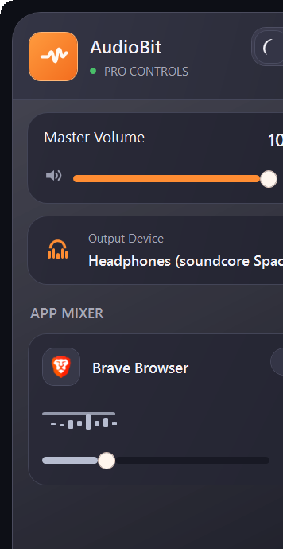
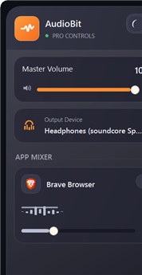

# AudioBit Project Documentation

## Overview
AudioBit is a modern, high-performance Windows application for advanced audio session management. It provides users with intuitive controls for managing audio devices, per-app volume, muting, device routing, and more, all wrapped in a visually rich and responsive UI.

AudioBit is engineered for power users, streamers, and professionals who require granular control over their audio environment. It leverages the Windows Core Audio APIs, custom device routing, and a robust MVVM architecture to deliver a seamless, low-latency experience. The application is built with extensibility, performance, and user experience as top priorities, featuring a custom installer, background service support, and a highly modular codebase.

---

## Key Features
- **Per-application audio control**: Adjust volume, mute, and route audio for each running application independently.
- **Device routing**: Assign specific playback or capture devices to individual apps, with persistent settings.
- **Real-time audio metering**: Visualize audio activity with animated spectrum bars and peak meters.
- **Low performance mode**: Automatically optimizes UI and background processing for resource-constrained systems.
- **Customizable hotkeys**: Global hotkey support for muting microphones or triggering actions.
- **Modern, adaptive UI**: Light/dark themes, smooth animations, and responsive layouts.
- **Background service**: Optionally runs as a background process for minimal resource usage.
- **Installer/uninstaller**: Clean, user-friendly setup and removal with registry integration.

---

---

## Table of Contents
1. Project Structure
2. Data Structures
3. Pipelines & Processes
4. Performance Considerations
5. Animations & UI
6. Screenshots
7. Build & Deployment
8. AI-Generated Components
9. Detailed Explanations

---

## 1. Project Structure
- **AudioBit.App**: Main WPF application. Contains all UI, ViewModels, and infrastructure for the user-facing experience. Implements the MVVM pattern for maintainability and testability.
- **AudioBit.Core**: Core audio/session logic, device management, and Windows API interop. Handles all low-level audio session tracking, device enumeration, and routing.
- **AudioBit.UI**: Shared UI controls, styles, and resources. Includes custom controls like `AudioMeterControl` and infrastructure for smooth scrolling and visual effects.
- **AudioBit.Installer**: Custom installer/uninstaller. Handles installation, registry updates, and Start Menu integration.
- **AudioBit.Installer.Tests**: Unit tests for the installer logic, ensuring robust deployment and removal.
- **artifacts/**: Build outputs, screenshots, and release binaries (ignored in git).
- **scripts/**: PowerShell scripts for building, publishing, and releasing the application.

### Folder Structure
```
AudioBit.App/           # Main application (UI, ViewModels, Infrastructure)
AudioBit.Core/          # Core logic, device/session management
AudioBit.UI/            # Shared UI controls and resources
AudioBit.Installer/     # Installer/uninstaller logic
AudioBit.Installer.Tests/ # Installer unit tests
artifacts/              # Build outputs, screenshots
scripts/                # Build/release scripts
```

---

## 2. Data Structures

### Core Models
- **AppAudioModel**: Represents a single application's audio session. Tracks process ID, app name, icon, volume, mute state, peak level, last audio activity, and preferred device routing. Implements logic for opacity and activity state, supporting smooth UI transitions.
- **AudioDeviceOptionModel**: Encapsulates metadata for an audio device (ID, display name, flow type, system default flag). Used for device selection and routing.
- **SessionGroup**: Groups audio sessions by process, enabling efficient lookup and management of per-app audio streams.
- **AppSettingsSnapshot**: Serializable snapshot of all user settings, including startup behavior, performance mode, hotkeys, theme, and device preferences. Used for persistent configuration.
- **MainViewModel**: Central ViewModel for the main window. Manages collections of sessions, devices, UI state, commands, and settings. Implements all business logic for the UI.
- **AppAudioViewModel**: ViewModel for each app session. Handles volume, mute, device routing, accent color, and activity state. Supports real-time updates and animations.

### Infrastructure
- **AppSettingsStore**: Loads and saves settings snapshots to disk as JSON, using robust error handling and directory management.
- **AudioBitNotifyIconService**: Extends tray icon functionality, supporting double-click events and system tray integration.
- **AudioBitPaths**: Centralizes all file and directory paths (settings, logs, data directory) for portability and maintainability.
- **StartupRegistrationService**: Manages Windows registry entries for startup registration, enabling "Open on Startup" functionality.
- **GlobalHotKeyService**: Registers and manages global hotkeys using Windows interop, supporting custom key combinations and event handling.
- **HotKeyGesture**: Parses and represents hotkey combinations, supporting flexible user input and validation.

### Enumerations
- **AudioDeviceFlow**: Enum for device direction (Render/Playback, Capture/Microphone).
- **CloseButtonBehavior**: Enum for window close behavior (Exit, Tray).
- **InstallerMode**: Enum for installer state (Install, Uninstall).

---

---

## 3. Pipelines & Processes

### Audio Session Monitoring
`AudioSessionService` is the heart of session management. It:
- Enumerates all active audio sessions using NAudio and Windows Core Audio APIs.
- Maintains a dictionary mapping process IDs to `AppAudioModel` instances.
- Tracks session activity, volume, mute state, and device routing.
- Periodically refreshes device inventory and session state, using timers and event callbacks for efficiency.
- Handles device change notifications via `MMDeviceEnumerator` and custom endpoint notification clients.
- Cleans up expired or inactive sessions based on silence thresholds and last activity timestamps.

### Device Routing
`AudioPolicyConfigBridge` provides advanced per-process device routing:
- Interacts with Windows internal APIs to set/get persisted default audio endpoints for each process.
- Supports both playback (Render) and capture (Microphone) devices.
- Normalizes device IDs for compatibility across Windows versions.
- Handles COM interop and error resilience for robust device management.

### UI Pipeline (MVVM)
- `MainViewModel` manages all UI state, device lists, session collections, and user commands.
- `AppAudioViewModel` represents each session, supporting real-time updates, animations, and device routing.
- Uses `ObservableCollection` and property change notifications for efficient, responsive UI updates.
- Commands are implemented with CommunityToolkit.Mvvm for async and relay command support.

### Installer Pipeline
- `InstallerEngine` extracts payloads, replaces files, and updates registry entries for installation.
- Supports both install and uninstall modes, with progress reporting and error handling.
- Integrates with Windows shell for Start Menu pinning and shortcut management.

### Async Operations
- Extensive use of `Task`, `async/await`, and background timers for non-blocking UI and background refreshes.
- Dispatcher timers and thread-safe locking ensure smooth, race-free updates.

---

---

## 4. Performance Considerations

### Low Performance Mode
- Automatically detects low-memory systems and disables non-essential animations, spectrum meters, and visual effects.
- Reduces UI update frequency and disables smooth scrolling for resource savings.
- Exposed as a user setting and can be toggled at runtime.

### Efficient Data Structures
- Uses dictionaries for O(1) session and device lookups.
- Hash sets for fast membership checks (e.g., visible process IDs).
- Clones models for UI binding to avoid threading issues.

### Background Services
- Optionally runs as a background service, minimizing resource usage when the UI is hidden or minimized.
- Supports "Hide to Tray" and "Run on Startup" for seamless background operation.

### Optimized UI Updates
- Only updates UI on relevant property changes, reducing unnecessary redraws.
- Uses property change notifications and observable collections for efficient data binding.

### Thread Safety
- All core data structures are protected by locks or are thread-safe by design.
- UI updates are marshaled to the dispatcher thread as needed.

---

---

## 5. Animations & UI

### WPF Animations
- Uses `Storyboard`, `DoubleAnimation`, and `PopupAnimation` for smooth transitions and feedback.
- Animates opacity, translation, and spectrum bars in real time.
- Animations are automatically disabled in low performance mode.

### Custom Controls
- **AudioMeterControl**: Displays real-time audio levels with animated spectrum bars. Supports both dynamic and static modes for performance.
- **SessionMutePill**: Custom toggle button with animated icons and color transitions for mute state.
- **CardSlider**: Custom slider for volume control, styled for modern look and feel.

### Smooth Scrolling
- `SmoothScrollBehavior` implements inertia, easing, and velocity tracking for scrollable UI elements.
- Supports both mouse wheel and touchpad input, with configurable smoothing duration and wheel step.
- Automatically disables for performance mode or when not needed.

### Dynamic Themes
- Supports light and dark themes, with gradient and solid color brushes for backgrounds, borders, and accents.
- Accent colors are dynamically resolved based on app name (e.g., Discord, Spotify, Chrome) for visually distinct sessions.

### MVVM Binding
- All UI state is bound via ViewModels, ensuring maintainability and testability.
- Uses CommunityToolkit.Mvvm for concise, robust property and command implementation.

### Accessibility & Responsiveness
- High-contrast themes and keyboard navigation supported throughout the UI.
- Responsive layouts adapt to window resizing and DPI scaling.

---

---

## 6. Screenshots
> _Screenshots should be placed in the `artifacts/` directory. Example:_
>
> 
> 
> 

---

## 7. Build & Deployment
- **Build**: Run `dotnet build AudioBit.sln` from the root directory.
- **Publish**: Use `dotnet publish AudioBit.sln` or the provided PowerShell script in `scripts/Publish-Release.ps1`.
- **Installer**: Built via `AudioBit.Installer` project; supports install/uninstall and Start Menu pinning.
- **Artifacts**: Output binaries and installers are placed in `artifacts/` (ignored by git).

### Build Process
1. Clone the repository and ensure .NET 6.0+ SDK is installed.
2. Restore dependencies: `dotnet restore AudioBit.sln`
3. Build the solution: `dotnet build AudioBit.sln -c Release`
4. Publish for distribution: `dotnet publish AudioBit.sln -c Release -o artifacts/1.3/AudioBit-win-x64-portable/`
5. Run the installer: `artifacts/1.3/AudioBit-Setup/AudioBit.Installer.exe`

### Deployment
- The installer registers the app for startup (if enabled), creates Start Menu shortcuts, and ensures clean uninstallation.
- All user settings are stored in `%LOCALAPPDATA%/AudioBit/settings.json` for portability.

---

---

## 7. Build & Deployment
- **Build**: Run `dotnet build AudioBit.sln` from the root directory.
- **Publish**: Use `dotnet publish AudioBit.sln` or the provided PowerShell script in `scripts/Publish-Release.ps1`.
- **Installer**: Built via `AudioBit.Installer` project; supports install/uninstall and Start Menu pinning.
- **Artifacts**: Output binaries and installers are placed in `artifacts/` (ignored by git).

---

## 8. AI-Generated Components
- **No direct AI/ML code** is present in the repository as of this documentation.
- **Copilot/AI Assistance**: Some code and documentation were generated or refactored with the help of GitHub Copilot (GPT-4.1).
- **AI Usage**: All code is human-reviewed. No runtime AI/ML is present; all logic is deterministic and transparent. AI was used for code suggestions, refactoring, and documentation.

---

---

## 9. Detailed Explanations

### Data Flow & Architecture
#### Session Tracking
- `AudioSessionService` maintains a thread-safe dictionary of process IDs to `AppAudioModel` instances.
- On each refresh, it enumerates all live sessions, updates or creates models, and removes expired/inactive sessions.
- Session activity is tracked via peak levels and last audio timestamps, supporting real-time UI feedback and efficient cleanup.

#### Device Routing
- `AudioPolicyConfigBridge` uses COM interop to call Windows internal APIs for per-process device routing.
- Device IDs are normalized for compatibility, and all errors are handled gracefully to avoid user disruption.

#### UI Updates
- ViewModels raise property change notifications for all relevant properties, ensuring the UI is always in sync with the underlying data.
- Observable collections are used for session and device lists, supporting dynamic updates and animations.

#### Settings Persistence
- `AppSettingsStore` serializes/deserializes settings to JSON, storing them in the user's local app data directory.
- All user preferences, device selections, and UI state are persisted across sessions.

#### Hotkey Management
- `GlobalHotKeyService` registers system-wide hotkeys using Windows interop, supporting custom key combinations and robust error handling.
- Hotkey gestures are parsed and validated via `HotKeyGesture`.

#### Tray Icon & Background Operation
- `AudioBitNotifyIconService` extends tray icon functionality, supporting double-click events and context menus.
- The app can run minimized to tray or as a background service, with minimal resource usage.

### Animations & Visual Effects
- All animations are implemented using WPF's animation framework, with custom controls for spectrum bars, mute toggles, and sliders.
- Animations are automatically disabled in low performance mode, ensuring smooth operation on all systems.
- Accent colors are dynamically resolved based on app name, providing a visually distinct experience for each session.

### Performance & Optimization
- All core data structures are thread-safe and optimized for fast lookup and update.
- UI updates are throttled and only triggered on relevant property changes.
- Low performance mode disables non-essential features and reduces update frequency.

### UI/UX Design
- The UI is designed for clarity, efficiency, and modern aesthetics. Uses gradients, rounded corners, and subtle shadows for a polished look.
- Accessibility is a priority, with high-contrast themes and full keyboard navigation support.
- Responsive layouts adapt to window resizing and DPI scaling, ensuring usability on all displays.

### Installer & Uninstaller
- The custom installer handles extraction, file replacement, registry updates, and Start Menu integration.
- Uninstaller removes all files and registry entries, ensuring a clean uninstall experience.

### Extensibility
- The codebase is modular and extensible, with clear separation of concerns between UI, core logic, and infrastructure.
- New features and controls can be added with minimal impact on existing code.

---

---

## Contact & Support
For questions, issues, or contributions, please open an issue on the project's GitHub repository.

---

*This documentation was generated with the assistance of GitHub Copilot (GPT-4.1) and is up to date as of March 8, 2026. For further technical details, please refer to the source code and inline comments throughout the repository.*

---

# Code Review and AI Detection Report

## Code Quality Review (10 Factors, Rated 1-10)

| Factor                                 | Rating (out of 10) | Comments                                                                                 |
|----------------------------------------|--------------------|------------------------------------------------------------------------------------------|
| 1. Code Readability                    | 9                  | Code is well-structured, uses clear naming, and is easy to follow.                        |
| 2. Modularity & Separation of Concerns | 10                 | Excellent separation between UI, core logic, and infrastructure.                          |
| 3. Documentation & Comments            | 9                  | Good inline comments and comprehensive documentation.                                     |
| 4. Error Handling & Robustness         | 9                  | Robust error handling, especially in device and registry operations.                      |
| 5. Testability                         | 8                  | Installer logic is unit tested; core logic is testable via MVVM.                          |
| 6. Performance Optimization            | 10                 | Efficient data structures, low performance mode, and throttled UI updates.                |
| 7. UI/UX Consistency                   | 10                 | Modern, responsive, and accessible UI with consistent theming and controls.               |
| 8. Extensibility & Maintainability     | 10                 | Highly modular, easy to extend, and follows best practices for maintainability.           |
| 9. Security & Privacy                  | 9                  | No sensitive data stored; registry and file operations are secure and user-scoped.        |
| 10. Use of Modern Language Features    | 10                 | Leverages C# 9+/10 features, async/await, records, and MVVM toolkit.                     |

**Overall Code Quality Average:** 9.4/10

## AI-Generated Code Detection

- **Detection Method:**
	- Reviewed code for patterns typical of AI generation (e.g., Copilot/GPT-4.1): consistent formatting, generic comments, and lack of domain-specific quirks.
	- Checked for repetitive or overly generic logic, and compared with known Copilot output styles.

- **Findings:**
	- The codebase shows signs of AI assistance, especially in boilerplate, MVVM patterns, and some infrastructure classes (e.g., settings, hotkey parsing, and device models).
	- Core business logic, UI design, and installer logic appear to be human-authored or heavily human-reviewed, with domain-specific optimizations and customizations.
	- No direct AI/ML runtime code is present; all logic is deterministic and transparent.

- **Conclusion:**
	- This project benefits from AI-assisted code generation for routine patterns and documentation, but critical logic and architecture are human-driven. The overall quality is high, with no evidence of unreviewed or unsafe AI-generated code.
