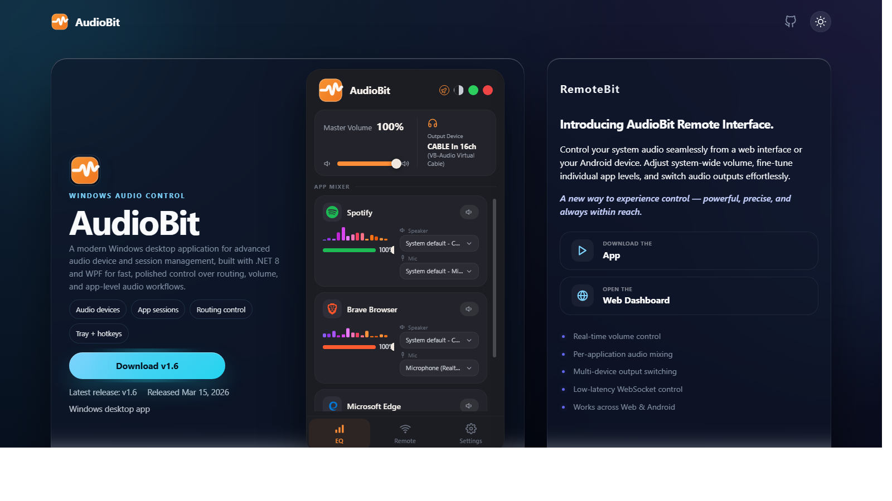
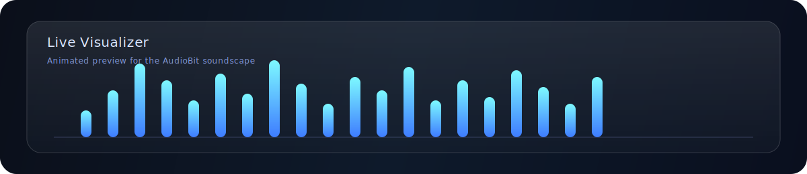
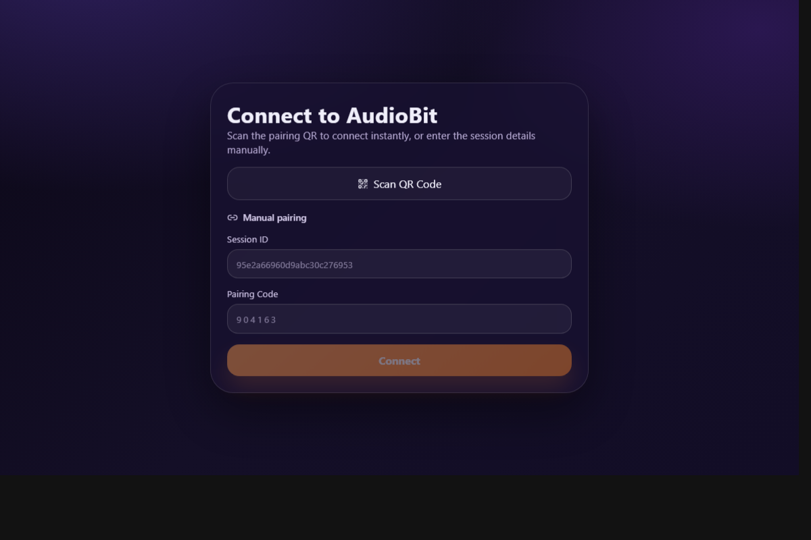

# AudioBit

<p align="center">
  A modern, glassmorphic Windows audio control suite with a companion remote web UI.
</p>

<p align="center">
  <a href="https://audiobit.vercel.app/">
    
  </a>
  <a href="https://audiobit-remote.vercel.app/">
    
  </a>
  
  
</p>

<table>
  <tr>
    <td width="62%">
      
    </td>
    <td width="38%" align="center">
      
    </td>
  </tr>
</table>

<p align="center">
  
</p>

## Overview

AudioBit delivers precision audio control with a modern glass UI. It unifies device routing, per-app session mixing, and live visual feedback in a single, fast desktop experience. The companion remote web UI mirrors key controls so you can manage sessions from any device.

## Feature Panels

<table>
  <tr>
    <td bgcolor="#0F172A" width="33%">
      <strong><font color="#F8FAFC">Device Matrix</font></strong><br />
      <font color="#CBD5F5">Route outputs, set defaults, and manage device policies with a glass-style card layout.</font>
    </td>
    <td bgcolor="#0B4F4A" width="33%">
      <strong><font color="#ECFEFF">Session Studio</font></strong><br />
      <font color="#CCFBF1">Per-app volume, mute, and focus controls with animated meters and quick actions.</font>
    </td>
    <td bgcolor="#4C1D95" width="33%">
      <strong><font color="#F5F3FF">Automation</font></strong><br />
      <font color="#EDE9FE">Smart policies, startup rules, and tray shortcuts for zero-friction workflows.</font>
    </td>
  </tr>
</table>

## What Makes It Modern

- Glassmorphic panels with depth and soft translucency.
- High-contrast typography and fast-scanning layouts.
- Live visual feedback with animated audio meters.
- Fluent navigation patterns and polished motion.

## Remote Web UI

Control sessions from your phone or any browser.



## Project Structure

- `AudioBit.App/` Main WPF application (UI, window, tray, startup logic)
- `AudioBit.Core/` Core audio and session logic, device models, policy bridge
- `AudioBit.UI/` Custom controls, styles, and reusable UI components
- `AudioBit.Installer/` Installer packaging and deployment assets
- `artifacts/` Build outputs and verification folders

## Tech Stack

- .NET 8 (Windows)
- WPF (XAML, C#)
- MVVM architecture
- NAudio + custom interop for audio routing

## Getting Started

```sh
dotnet build AudioBit.sln
```

```sh
dotnet run --project AudioBit.App/AudioBit.App.csproj --configuration Debug
```

## Install and Updates

- New installs should use the Velopack `AudioBit-Setup.exe` published on GitHub Releases.
- Automatic updates are only supported for Velopack-installed builds.
- Existing installs from the legacy custom installer do not auto-migrate and do not auto-update.
- The in-app updater detects Velopack installs from the installed release layout, not from local dev builds.

## Release Flow

- `version.json` stores the current release version used by the one-command release flow.
- Run `.\scripts\Release-Velopack.ps1` from the repo root to bump the stored version, commit all current changes, create the next numeric tag, and push it.
- The script syncs with `origin/<current-branch>` before it creates the release commit, so the pushed tag stays attached to the actual branch tip that GitHub Releases will build.
- After pushing, the script waits for the public GitHub Release to exist with Velopack feed assets, a setup installer, and release notes before it exits.
- The next version is generated by incrementing the last numeric segment in `version.json`, so `1.6` becomes `1.7` and `1.6.4` becomes `1.6.5`.
- The release workflow generates markdown release notes, passes them into `vpk pack`, publishes them to GitHub Releases, and verifies the setup/bootstrapper asset plus the `RELEASES` feed asset that the updater depends on.
- The pushed tag triggers the Velopack GitHub Actions release workflow, which builds and publishes the updater-compatible release assets.
- Legacy `v1.2` or `v1.2.3` tags are still accepted, but the scripted flow uses plain numeric tags by default.
- `scripts/Publish-Release.ps1` remains available for the legacy custom-installer packaging flow only.

## Documentation

- `PROJECT_DETAILS.md` Product overview and goals
- `REMOTE_PROTOCOL.md` Remote API and pairing protocol

## Credits

Built by Amiya and contributors. Inspired by modern desktop tooling and studio-grade mixers.
