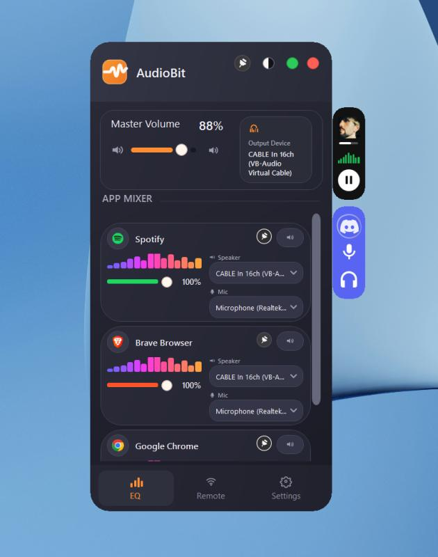
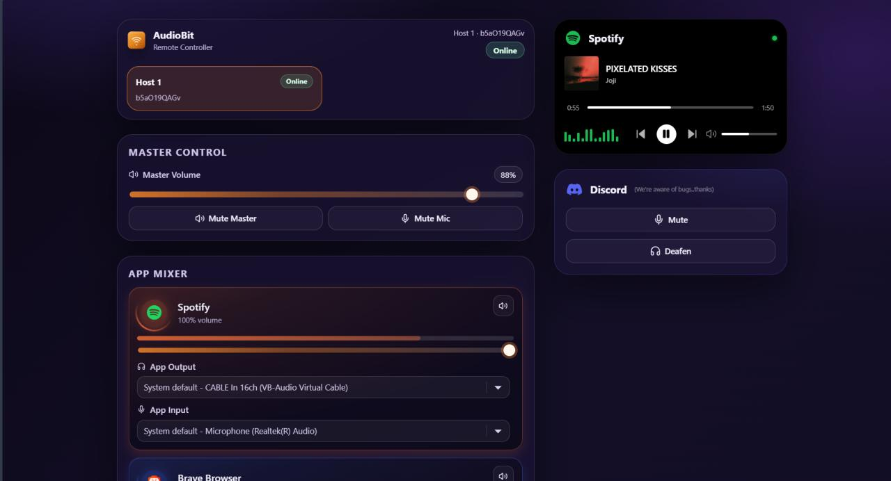
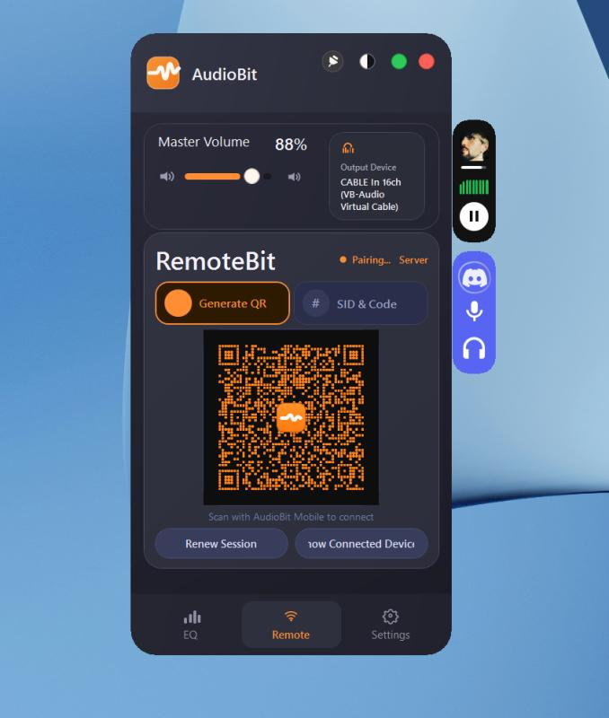

<h1 align="center">AudioBit</h1>

<p align="center">
  AudioBit is a modern Windows WPF application for advanced per-application audio control, routing, metering, hotkeys, and sessions.
</p>

<p align="center">
  <a href="https://audiobit.vercel.app/" target="_blank">
    
  </a>
  <a href="https://audiobit-remote.vercel.app/" target="_blank">
    
  </a>
  
</p>

<br/>

<div align="center">
  
</div>

<br/>

## Capabilities

**Session Studio**
Per-app volume, mute, and focus controls featuring live hardware-accelerated meters and fast-action shortcuts. Modern and responsive UI without fighting Windows settings.

**Device Matrix**
Manage playback endpoints manually or set automation rules for your audio session switching.

**Web Remote**
Seamlessly adjust session volumes from any browser over your network via a lightweight sync protocol.

<br/>

<div align="center">
  <table>
    <tr>
      <td align="center" width="50%">
        
        <br/><em>Web Remote Session Mixer</em>
      </td>
      <td align="center" width="50%">
        
        <br/><em>Remote Connection Window</em>
      </td>
    </tr>
  </table>
</div>

<br/>

## Environment & Tech

- **Platform:** Windows 10/11
- **Runtime:** .NET 8.0 
- **Framework:** WPF (C#, XAML)
- **Audio Core:** NAudio / Custom MMDevice API Interop

## Development

```sh
# Clone repository
git clone https://github.com/ami-nope/AudioBit.git

# Build solution
dotnet build AudioBit.sln

# Run desktop host
dotnet run --project AudioBit.App/AudioBit.App.csproj --configuration Debug
```

## Releases & Updates

Automatic background updates are powered by **Velopack**.
- **Installation:** Download `AudioBit-Setup.exe` from the latest GitHub Release.
- **Updates:** The application poles the Velopack feed dynamically during runtime and transitions via app restart without manual intervention.

## Update System
The AudioBit update architecture is not a standard background process; it is a mathematically precise delivery engine designed to completely overshadow conventional software deployment. Powered by Velopack, the update pipeline operates with absolute authority and zero user friction. It aggressively queries the release feed during runtime, utilizing differential binary targeting to rip only the exact delta changes across the network, minimizing bandwidth while maximizing speed.

When a new build is detected, the engine invisibly stages the payload in volatile memory space and prepares a synchronous pivot. There are no installation wizards. There are no progress bars or permission prompts. You close the application, and the moment it restarts, it executes a flawless environment transition into a cryptographically validated, bleeding-edge master build.

By systematically bypassing all legacy Windows installer bloat, the host engine guarantees unparalleled execution integrity. This is not just automatic updating—it is continuous integration weaponized for the desktop, delivering instant, mandatory perfection the second a release hits production.


#Local build pipelines and debug :
- `.\scripts\Release-Velopack.ps1` - Version bumping, git tagging, and packaging.
- `.\scripts\Build-BootstrapInstaller.ps1` - Executes raw setup bundle generation.
  `dotnet run --project AudioBit.App\AudioBit.App.csproj` - Debug Run 
## Project Structure

- `AudioBit.App/` UI elements, updater integration, and core routing shell.
- `AudioBit.Core/` Deep NAudio integration, policy routing constraints.
- `AudioBit.Installer/` Setup bootstrapping logic and environment assets.
- `Documentation/` Details on update protocol and internal systems.

<br/>


